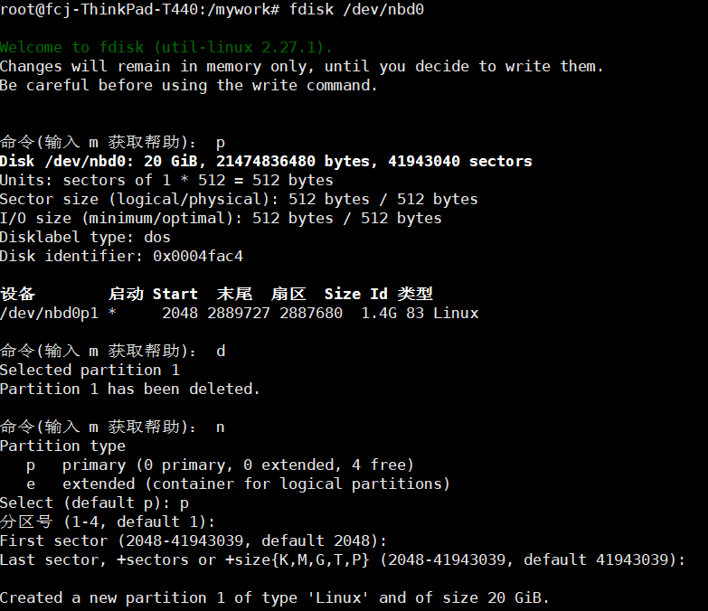
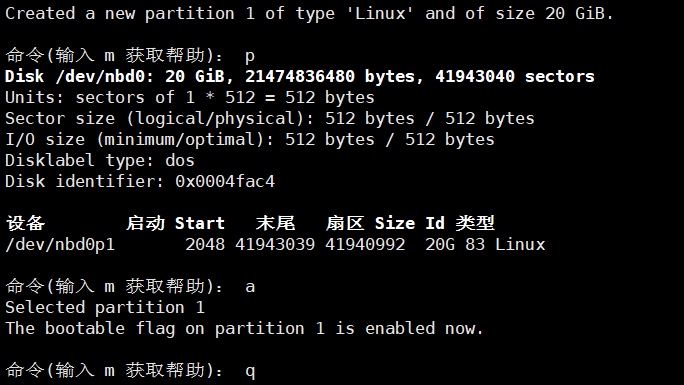

# om-miner(00) arm嵌入式入门基础

## 安装QEMU

```
//安装QEMU
apt-get install -y qemu
//Qemu为模拟器，可以模拟ARM

//下载QEMU镜像
cd /mywork
wget https://cloud-images.ubuntu.com/trusty/current/trusty-server-cloudimg-arm64-disk1.img
file trusty-server-cloudimg-arm64-disk1.img
//trusty-server-cloudimg-arm64-disk1.img: QEMU QCOW Image (v2), 2361393152 bytes

//镜像文件扩容
qemu-img resize trusty-server-cloudimg-arm64-disk1.img 20G
modprobe nbd max_part=8
//使用qemu-nbd挂载该镜像
qemu-nbd -c /dev/nbd0 trusty-server-cloudimg-arm64-disk1.img

//对其进行分区调整
fdisk /dev/nbd0
```





```
//使文件系统适应扩展后的镜像
e2fsck -f /dev/nbd0p1
resize2fs /dev/nbd0p1

//提取vmlinuz和intrid.img
mount /dev/nbd0p1 /mnt
cp /mnt/boot/vmlinuz-4.4.0-112-generic ./
cp /mnt/boot/initrd.img-4.4.0-112-generic ./
umount /mnt
qemu-nbd -d /dev/nbd0

//启动QEMU
qemu-system-aarch64 \
  -machine type=virt -cpu cortex-a57 -smp 1 -m 2048 -nographic \
  -rtc driftfix=slew -kernel vmlinuz-4.4.0-112-generic \
  -append "console=ttyAMA0 root=LABEL=cloudimg-rootfs rw init=/bin/sh" \
  -initrd initrd.img-4.4.0-112-generic -device virtio-blk-device,drive=image \
  -netdev user,id=user0 -device virtio-net-device,netdev=user0 -drive if=none,id=image,file=trusty-server-cloudimg-arm64-disk1.img
//暂未解决上网问题，待补充

//退出QEMU
apt install screen
screen -S arm64 -p 0 -X stuff "^ax"
```

## 安装gcc-arm-linux-gnueabihf/g++-arm-linux-gnueabihf

```
//适用于armhf架构的交叉编译器
apt-get install -y gcc-arm-linux-gnueabihf
apt-get install -y g++-arm-linux-gnueabihf

//补充：armel为arm eabi little endian的缩写，eabi是软浮点二进制接口
//armhf为arm hard float的缩写
```

## 安装arm-none-eabi-g++

```
add-apt-repository ppa:team-gcc-arm-embedded/ppa
apt-get update
apt-get install -y gcc-arm-embedded
arm-none-eabi-gcc -v
arm-none-eabi-g++ -v
//arm-none-eabi，用于编译ARM架构的裸机系统，包括ARM Linux的boot、kernel
//一般适合ARM7、Cortex-M和Cortex-R内核的芯片使用，不支持跟操作系统关系密切的函数
```

## 参考文档

* [交叉编译器 arm-linux-gnueabi 和 arm-linux-gnueabihf 的区别](http://www.cnblogs.com/xiaotlili/p/3306100.html)
* [armel和armhf区别选择](http://www.veryarm.com/872.html)
* [arm交叉编译器gnueabi、none-eabi、arm-eabi、gnueabihf、gnueabi区别](http://www.veryarm.com/296.html)
* [Ubuntu 14.04中安装QEMU](https://www.linuxidc.com/Linux/2016-08/134084.htm)
* [虚拟机初探之 QEMU](http://lifeinlinux.blogspot.com/2008/04/qemu.html)
* [从零使用qemu模拟器搭建arm运行环境](http://blog.csdn.net/linyt/article/details/42504975)
* [ARM64调试环境](https://www.cnblogs.com/wangaohui/p/5184476.html)