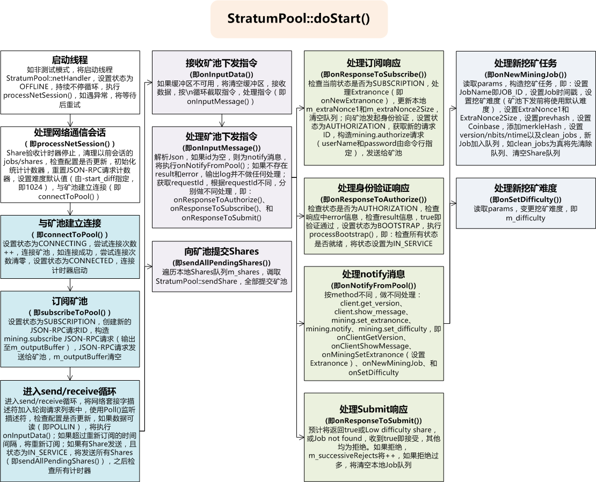

# om-miner(02) sm-miner-master程序运行

## 程序运行

```c++
void ApplicationImpl::run()
{
    LOG_TRACE(logger) << "Running the application...\n";
	//检查是否已初始化
    ensureInitialized();
	//是否测试模式
    if (config()->testConfig.testMode != TEST_MODE_NONE)
    {
        g_serverTest.run();
    }
    else
    {
        //程序组件启动
        start();
        appMain();
        stop();
    }
}
//代码位置sm-miner-master/src/app/ApplicationImpl.cpp
```

## 程序组件启动

```
void ApplicationImpl::start()
{
    LOG_TRACE(logger) << "Starting application components...\n";
	//是否已启动
    if (m_started)
        throw ApplicationException("Application is already started.");
	//是否已初始化
    ensureInitialized();
    //启动所有程序组件
	//
    if (m_appRegistry.selectComponents())
    {
        while (AppComponent* appComponent = m_appRegistry.nextComponent())
			//即调取doStart()
			//即GpioPolling::doStart()和StratumPool::doStart()
            appComponent->start();
    }
    m_started = true;
}
//代码位置sm-miner-master/src/app/ApplicationImpl.cpp
```

## StratumPool启动



## 参考文档


