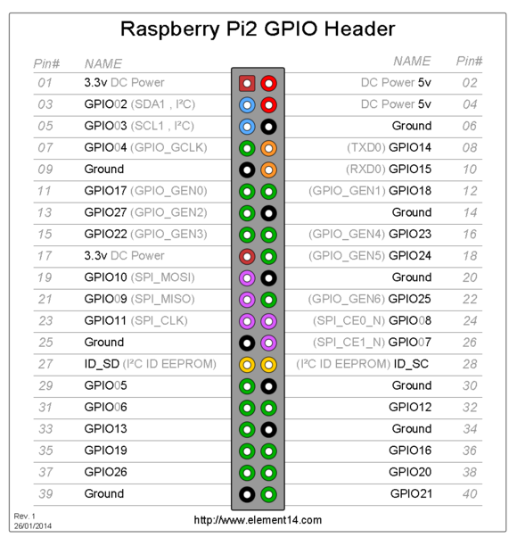

# om-miner(03) Gpio+Raspberry Pi 

## GpioPin

```c++
class GpioPin
{
public:
	virtual void set(bool value) const = 0;
	virtual uint8_t read() const = 0;
};

class GpioPinDummy
	: public GpioPin
{
public:
	virtual void set(bool value) const {}
	virtual uint8_t read() const {}
};
//代码位置sm-miner-master/src/hw/GpioPin.h

class GpioPinPi
	: public GpioPin
{
public:
	static void initMapping();
	static uint8_t pinToGpio(uint8_t pinNumber);
    GpioPinPi(uint8_t _gpioNumber, bool isInput=false);
	void set(bool value) const;
	uint8_t read() const;
private:
	uint8_t gpioNumber;
};
//代码位置sm-miner-master/src/hw/GpioPinPi.h
```

## GpioPinPi::initMapping()

```c++
void GpioPinPi::initMapping()
{
	//bcm2835 lib初始化
	if (!bcm2835_init())
		throw ApplicationException("GpioPinPi: bcm2835 lib init failed");
}
```

## GpioPinPi::pinToGpio() pin与Gpio转换

```c++
uint8_t GpioPinPi::pinToGpio(uint8_t pinNumber)
{
	uint8_t gpioNumber = 0;
	switch (pinNumber)
	{
	case  3: gpioNumber =  2; break;
	case  5: gpioNumber =  3; break;
	case  7: gpioNumber =  4; break;
	case  8: gpioNumber = 14; break;
	case 10: gpioNumber = 15; break;
	case 11: gpioNumber = 17; break;
	case 12: gpioNumber = 18; break;
	case 13: gpioNumber = 27; break;
	case 15: gpioNumber = 22; break;
	case 16: gpioNumber = 23; break;
	case 18: gpioNumber = 24; break;
	case 19: gpioNumber = 10; break;
	case 21: gpioNumber =  9; break;
	case 22: gpioNumber = 25; break;
	case 23: gpioNumber = 11; break;
	case 24: gpioNumber =  8; break;
	case 26: gpioNumber =  7; break;

	default:
		throw ApplicationException("GpioPinPi: can't map pin %u to gpio", pinNumber);
	}

	//printf("GpioPinPi: map pin %u to gpio %u\n", pinNumber, gpioNumber);
    return gpioNumber;
}


更详细内容参考：[树莓派---GPIO应用详解](https://www.jianshu.com/p/f31b90cc756f)

## 参考文档

* [树莓派学习笔记——I2C PCF8574 BCM2835 Library](http://blog.csdn.net/xukai871105/article/details/14109211)
* [树莓派入门教程——GPIO初级使用学习](http://www.embed-net.com/thread-139-1-1.html)
* [树莓派---GPIO应用详解](https://www.jianshu.com/p/f31b90cc756f)