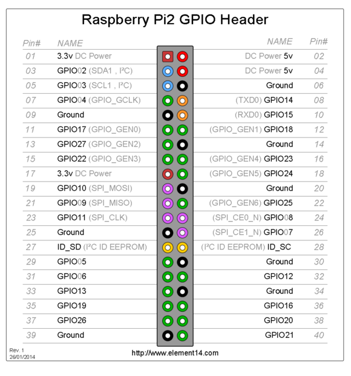

# om-miner(04) GpioManager

## GpioManager定义

```c++
class GpioManager
{
public:
	GpioManager();
	void init();
	void slaveResetByMask(uint32_t mask);
	void slaveReset(uint32_t sid);
	void slaveSelect(uint32_t sid, uint8_t value);

private:
	GpioPin* createPin(uint8_t pinNumber, bool isInput=false);
	void setMuxAddr(uint32_t addr);
	void readHwVer();
	GpioPin *pinMux0; //输出，GPIO18，GPIO_GEN1
	GpioPin *pinMux1; //输出，GPIO22，GPIO_GEN3
	GpioPin *pinHwVer; //输入，GPIO07，SPI_CE1_N
	GpioPin *pinNRst; //输出，GPIO04，GPIO_GCLK
	GpioPin *pinBoot; //输出，GPIO17，GPIO_GEN0
	GpioPin *pinNss; //输出，GPIO08，SPI_CE0_N

public:
	bool    spiSwMode;
	uint8_t mbHwVer; 
	GpioPin *pinLedR; //输出，GPIO23，GPIO_GEN4
	GpioPin *pinLedG; //输出，GPIO24，GPIO_GEN5
	GpioPin *pinKey0; //输入，GPIO25，GPIO_GEN6
	GpioPin *pinKey1; //输入，GPIO27，GPIO_GEN2
    GpioPin *pinSpiMosi; //输出，GPIO10，SPI_MOSI //MOSI，主输出从输入，即Master输出到Slave的数据线
    GpioPin *pinSpiMiso; //输入，GPIO09，SPI_MISO //MISO，主输入从输出，即Slave输出到Master的数据线
    GpioPin *pinSpiClk; //输出，GPIO11，SPI_CLK //CLK，即Master到Slave的通讯时钟
};
extern GpioManager g_gpioManager;
```


更详细内容参考：[树莓派---GPIO应用详解](https://www.jianshu.com/p/f31b90cc756f)

## GpioManager实现

```c++
//全局变量
GpioManager g_gpioManager;

//构造函数
GpioManager::GpioManager()
	: spiSwMode(false), mbHwVer(0)
{}

//初始化
void GpioManager::init()
{
	//命令行中指定-slave_spi_drv <dm>
	//Master SPI: drv mode 0-hw, 1-sw, 2-auto (default: SPI_DRV_AUTO)
	switch (Application::configRW().slaveSpiDrv)
	{
	case SPI_DRV_SW:
		spiSwMode = true;
		break;
	case SPI_DRV_AUTO:
		break;
	}

	if (spiSwMode) {
		printf("WARNING: GpioManager: running SPI in SW mode\n");
	}

	//Gpio初始化
	//按CPU类型分为RaspberryPi和OrangePi
	switch (g_cpuInfo.cpuType)
	{
	case CpuInfo::CPU_RPI: GpioPinPi::initMapping(); break;
	case CpuInfo::CPU_OPI: GpioPinOPi::initMapping(); break;
	default:
		throw ApplicationException("GpioManager: unexpected cpu type");
    }

    //按PIN编号创建Pin
	//输出
	pinLedR         = createPin(16); //GPIO23，GPIO_GEN4
	pinLedG         = createPin(18); //GPIO24，GPIO_GEN5

	//输入
	pinKey0         = createPin(22, true); //GPIO25，GPIO_GEN6
	pinKey1         = createPin(13, true); //GPIO27，GPIO_GEN2

	if (spiSwMode) {
		//MOSI，主输出从输入，即Master输出到Slave的数据线
		//MISO，主输入从输出，即Slave输出到Master的数据线
		//CLK，即Master到Slave的通讯时钟
		pinSpiMosi      = createPin(19); //输出，GPIO10，SPI_MOSI
		pinSpiMiso      = createPin(21, true); //输入，GPIO09，SPI_MISO
		pinSpiClk       = createPin(23); //输出，GPIO11，SPI_CLK
	}
	else {
		//不能在硬件模式下创建Pin
		//将创建虚拟Pin
		pinSpiMosi      = new GpioPinDummy();
		pinSpiMiso      = new GpioPinDummy();
		pinSpiClk       = new GpioPinDummy();

		// for OrangePi Zero pull-up (or down) input MISO pin to avoid
		// random data, when slave is not ready for communication
		if (g_cpuInfo.cpuType == CpuInfo::CPU_OPI)
		{
			GpioPinOPi::setupPull(GpioPinOPi::pinToGpio(21), GpioPinOPi::PULL_UP);
		}
	}

	pinMux0    = createPin(12); //输出，GPIO18，GPIO_GEN1
	pinMux1    = createPin(15); //输出，GPIO22，GPIO_GEN3
	pinHwVer   = createPin(26, true); //输入，GPIO07，SPI_CE1_N

	pinNRst    = createPin(7); //输出，GPIO04，GPIO_GCLK
	pinBoot    = createPin(11); //输出，GPIO17，GPIO_GEN0
	pinNss     = createPin(24);//输出，GPIO08，SPI_CE0_N

	//读取HwVer
	//Use mb hw ver: 0xff-auto, 0xf-6 boards, 0x1-24 boards (default: 0xff)
	readHwVer();

	//-no_mcu_reset Disable MCU reset on start-up
	if (Application::configRW().noMcuReset)
	{
		printf("GpioManager: no MCU reset mode\n");
	}
	else {
		//-slave_mask <bin> Set slave mask (default: 0xffffffff)
		uint32_t slaveMask = Application::configRW().slaveMask;
		printf("GpioManager: reset slaves, mask 0x%02x\n", slaveMask);
		//使用slaveMask重置slave
		slaveResetByMask(slaveMask);
	}
}

//创建Pin
//支持RaspberryPi和OrangePi
GpioPin *GpioManager::createPin(uint8_t pinNumber, bool isInput)
{
	switch (g_cpuInfo.cpuType)
	{
	case CpuInfo::CPU_RPI: return new GpioPinPi(GpioPinPi::pinToGpio(pinNumber), isInput);
	case CpuInfo::CPU_OPI: return new GpioPinOPi(GpioPinOPi::pinToGpio(pinNumber), isInput);

	default:
		throw ApplicationException("GpioManager: unexpected cpu type");
	}
}

//设置MuxAddr
void GpioManager::setMuxAddr(uint32_t addr)
{
	pinMux0->set((addr >> 0) & 1);
	pinMux1->set((addr >> 1) & 1);
}

//读取HwVer
void GpioManager::readHwVer()
{
	for (int i = 0; i < 4; i++)
	{
		setMuxAddr(i);
		mbHwVer |= (pinHwVer->read() << i);
	}

	printf("GpioManager: mbHwVer 0x%x\n", mbHwVer);

	//mbHwVer默认值0xff
	//可从命令行中指定-mb_hw_ver <dm> //Use mb hw ver: 0xff-auto, 0xf-6 boards, 0x1-24 boards (default: 0xff)
	if (Application::configRW().mbHwVer != 0xff)
	{
		mbHwVer = Application::configRW().mbHwVer;
		printf("GpioManager: replaced mbHwVer 0x%x\n", mbHwVer);
	}

	switch (mbHwVer) {
	case 0xf: EnvManager::slaveCount = 1; break;
	case 0x1: EnvManager::slaveCount = 4; break;
	default:  EnvManager::slaveCount = 4; break;
	}

	printf("GpioManager: slave MCU count %d\n", EnvManager::slaveCount);
}

//使用slaveMask重置slave
void GpioManager::slaveResetByMask(uint32_t mask)
{
	//printf("GpioManager::slaveResetByMask: mask = 0x%02x\n", mask);
	for (int i = 0; i < EnvManager::slaveCount; i++)
	{
		if (mask & (1 << i))
		{
			slaveReset(i);
		}
	}
}

//重置slave
void GpioManager::slaveReset(uint32_t sid)
{
	printf("GpioManager::slaveReset: sid = %u\n", sid);
	setMuxAddr(sid);

	pinNRst->set(0);
	pinBoot->set(0);

	usleep(200 * 1000);

	pinNRst->set(1);
}

void GpioManager::slaveSelect(uint32_t sid, uint8_t value)
{
	//printf("GpioManager::slaveSelect: sid = %u, value = %u\n", sid, value);
	setMuxAddr(sid);
	pinNss->set(!value);
}
```

